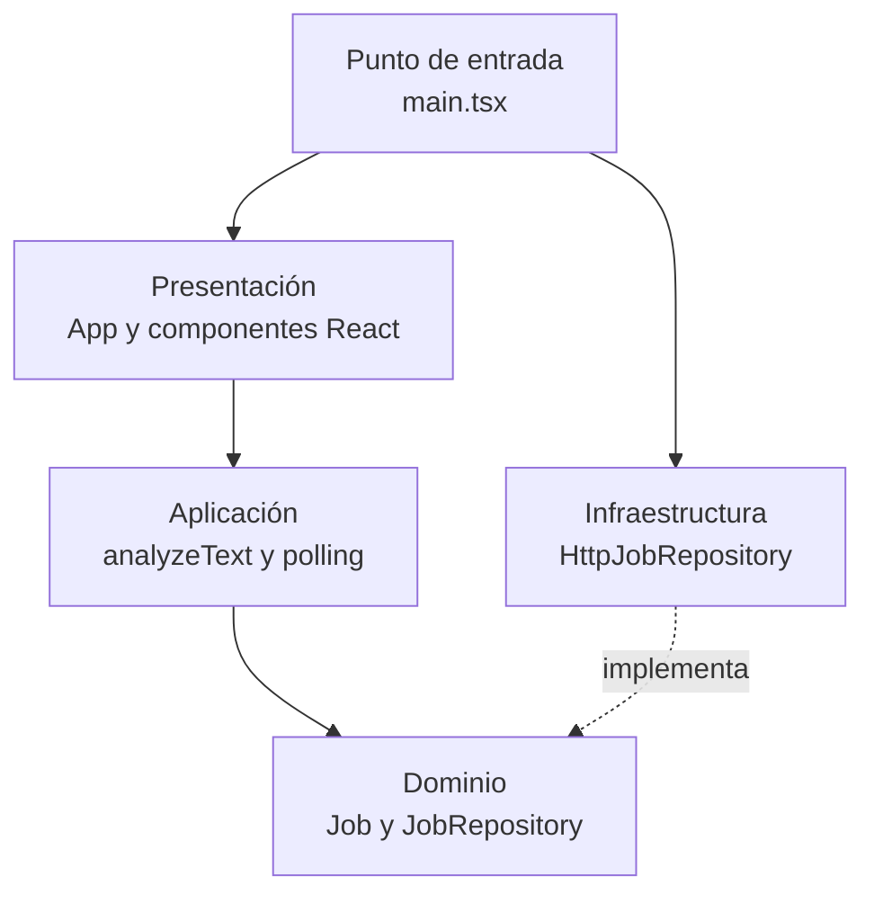

# Capas del frontend

```mermaid
flowchart TB
  ROOT[Punto de entrada<br/>main.tsx] --> UI
  ROOT --> INF
  UI[Presentación<br/>App y componentes React] --> UC[Aplicación<br/>analyzeText y polling]
  UC --> D[Dominio<br/>Job y JobRepository]
  INF[Infraestructura<br/>HttpJobRepository] -. implementa .-> D
```
