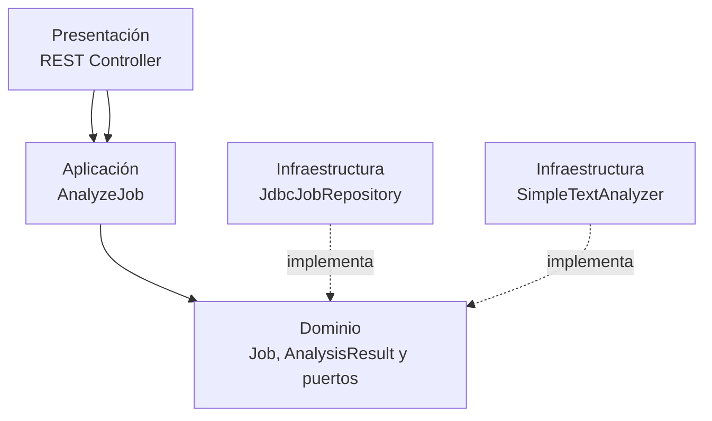

# Capas del servicio Java

```mermaid
flowchart TB
  API[Presentación<br/>REST Controller] --> UC[Aplicación<br/>AnalyzeJob]
  UC --> D[Dominio<br/>Job, AnalysisResult y puertos]
  JDBC[Infraestructura<br/>JdbcJobRepository] -. implementa .-> D
  ALG[Infraestructura<br/>SimpleTextAnalyzer] -. implementa .-> D
  API --> UC
```

