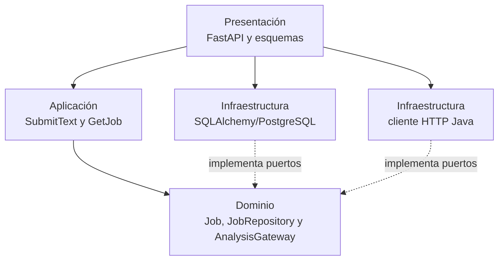

# Capas del servicio Python

```mermaid
flowchart TB
  API[Presentación<br/>FastAPI y esquemas] --> UC[Aplicación<br/>SubmitText y GetJob]
  UC --> D[Dominio<br/>Job, JobRepository y AnalysisGateway]
  DB[Infraestructura<br/>SQLAlchemy/PostgreSQL] -. implementa puertos .-> D
  HTTP[Infraestructura<br/>cliente HTTP Java] -. implementa puertos .-> D
  API --> DB
  API --> HTTP
```

