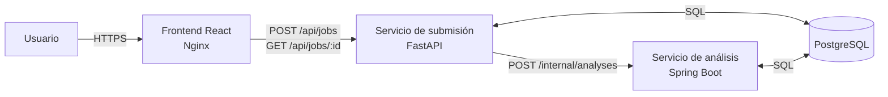

# Diagrama de componentes

```mermaid
flowchart LR
  U[Usuario] -->|HTTPS| F[Frontend React<br/>Nginx]
  F -->|POST /api/jobs<br/>GET /api/jobs/:id| P[Servicio de submisión<br/>FastAPI]
  P -->|POST /internal/analyses| J[Servicio de análisis<br/>Spring Boot]
  P <-->|SQL| DB[(PostgreSQL)]
  J <-->|SQL| DB
```

