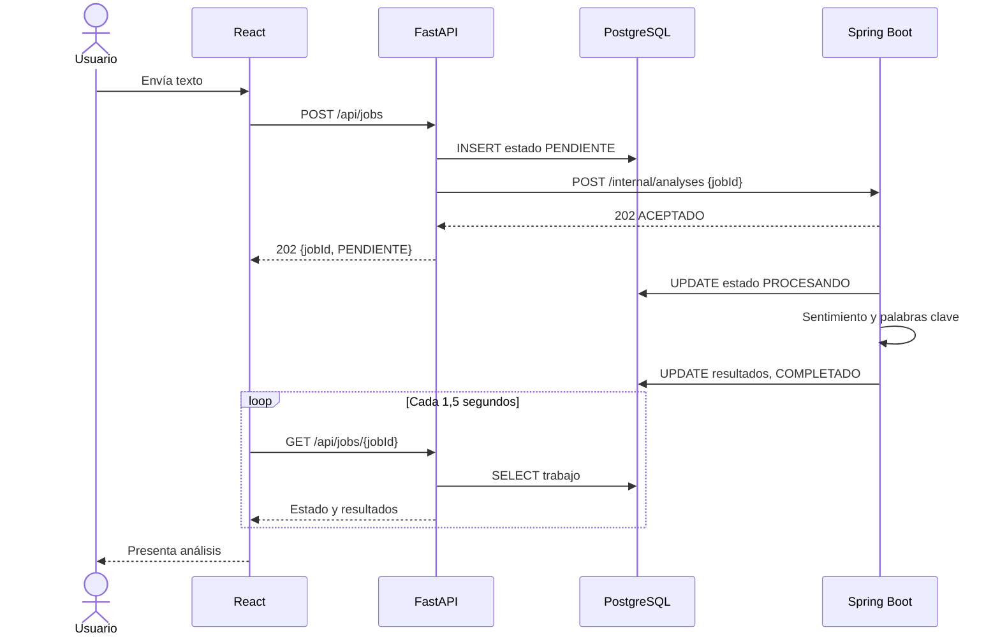

# Diagrama de secuencia

```mermaid
sequenceDiagram
  actor U as Usuario
  participant F as React
  participant P as FastAPI
  participant DB as PostgreSQL
  participant J as Spring Boot
  U->>F: Envía texto
  F->>P: POST /api/jobs
  P->>DB: INSERT estado PENDIENTE
  P->>J: POST /internal/analyses {jobId}
  J-->>P: 202 ACEPTADO
  P-->>F: 202 {jobId, PENDIENTE}
  J->>DB: UPDATE estado PROCESANDO
  J->>J: Sentimiento y palabras clave
  J->>DB: UPDATE resultados, COMPLETADO
  loop Cada 1,5 segundos
    F->>P: GET /api/jobs/{jobId}
    P->>DB: SELECT trabajo
    P-->>F: Estado y resultados
  end
  F-->>U: Presenta análisis
```

